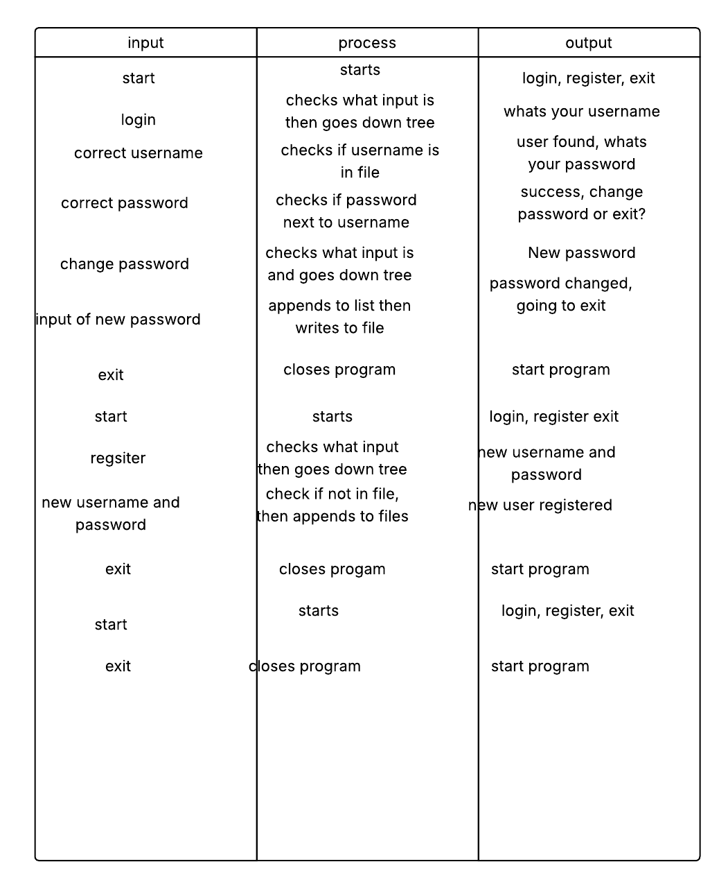
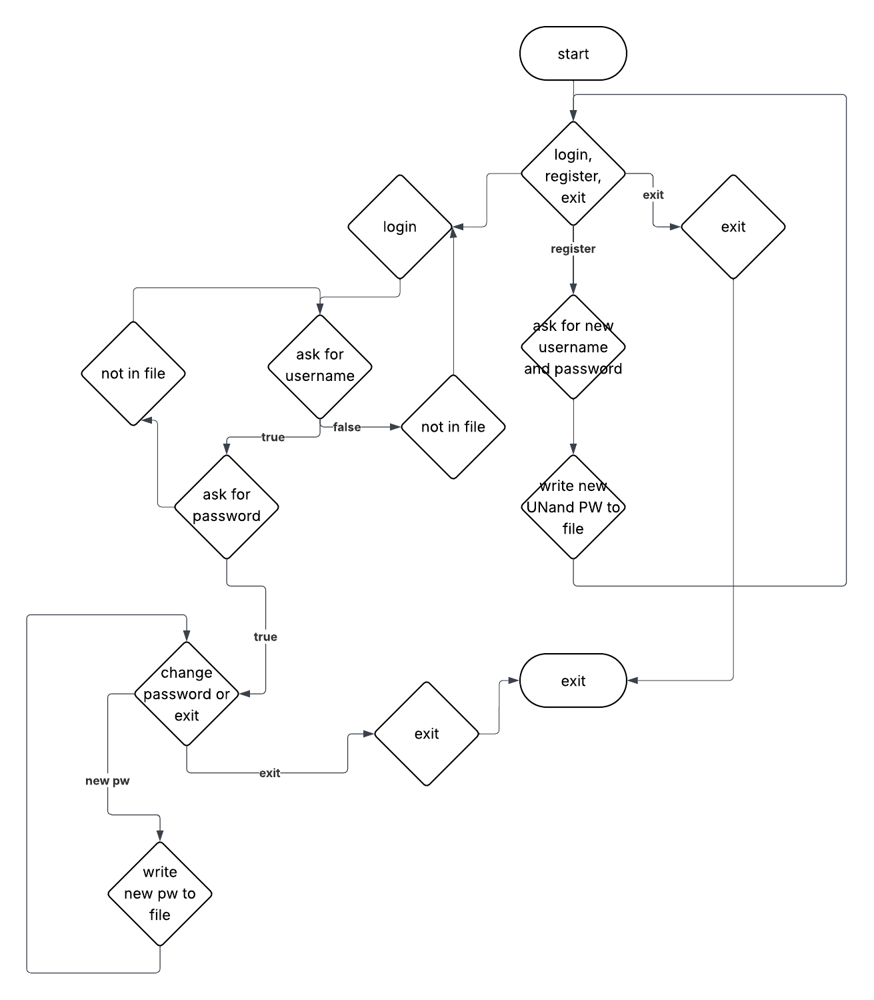
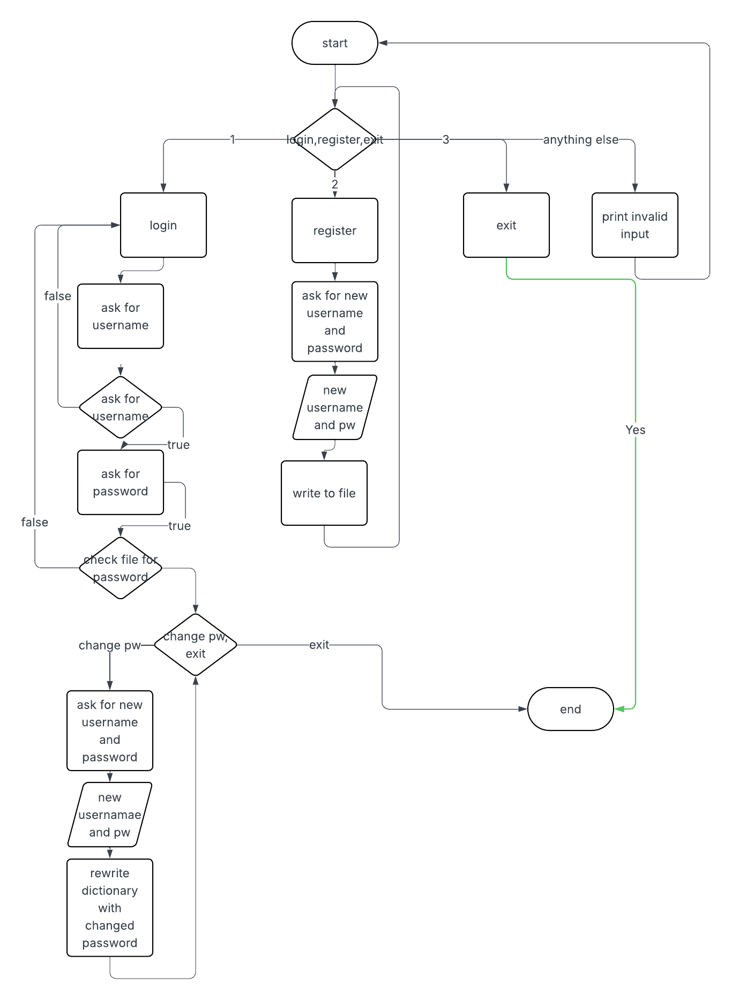

# Project Title

Command Line Login application

## Description

A simple command line login application with a menu and functionality as follows:

* Login – Not logged-in users can log in with existing username and password stored in source.txt. A correct login combination updates the menu to include 'Change password' and 'Logout' and exclude 'Login', 'Register' and ‘Quit’
* Register – Not logged-in users can create a new account with username and password which is stored in source.txt with the password salted and hashed, the new username must be unique, and then user can log in using the new username and password
* Quit – Not logged-in users can end the program
Change password – A logged-in user can change their password which is updated in source.txt with a minimum password length of 4 characters
* Logout - A logged-in user can logout ending the program

## Documentation

### IPO Table



### Structure chart



### Flow chart



## Getting Started

### Dependencies

* bcrypt

*Dependencies are installed by requirements.txt*

### Installing

* Deploy to a GitHub Codespace
* Wait for dependancies and extensions to install

### Executing program

* At the bash command prompt:

``` bash
    $ cd my_work
    $ python main.py
```

## Help

Any advise for common problems or issues.


## Authors

Contributors names and contact info

ex. [YOUR NAME](YOUR GITHUB PROFILE)


## Version History

* 0.2
    * First release
* 0.1
    * Template formed

## License

This project is licensed under the [NAME HERE] License - see the LICENSE.md file for details

## Acknowledgments

Inspiration, code snippets, etc.
* [Github md syntax](https://docs.github.com/en/get-started/writing-on-github/getting-started-with-writing-and-formatting-on-github/basic-writing-and-formatting-syntax)
* [TempeHS Python template](https://github.com/TempeHS/TempeHS_Python_DevContainer)
* [CS50 Python Notes](https://github.com/TempeHS/PythonFundamentals)
* [Bcrypt documentation](https://pypi.org/project/bcrypt/)